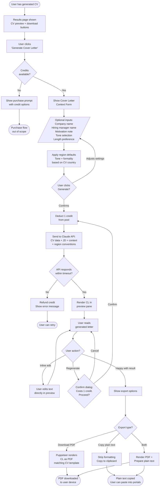
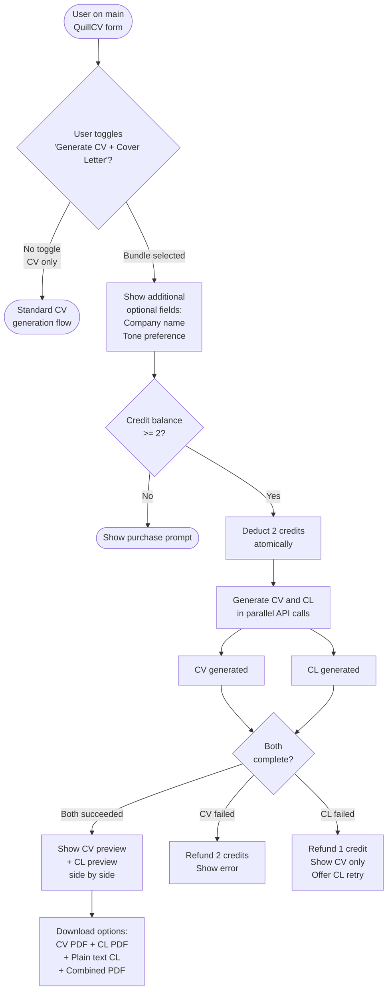
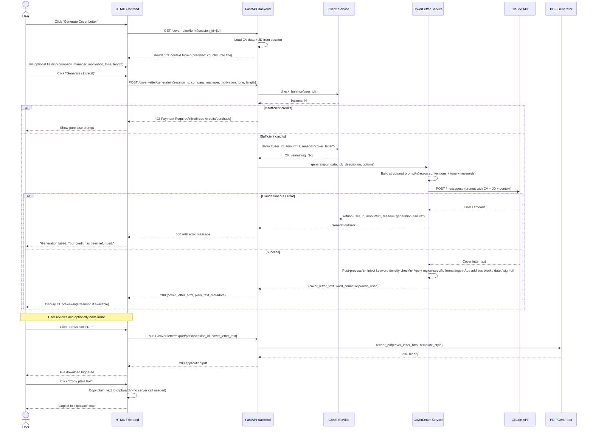
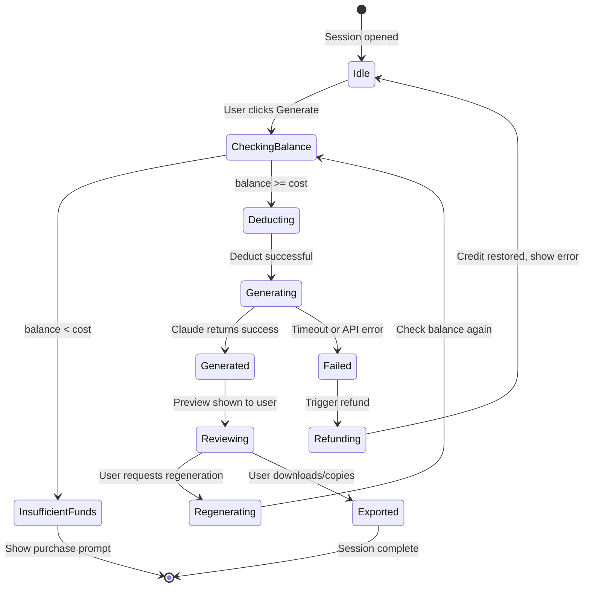

# Logic Visualization: Cover Letter Generation
**Feature**: Cover Letter Generation for QuillCV
**Date**: 2026-03-15
**Technique**: Event Storming + Flowcharts + Sequence Diagrams

---

## Part 1: Event Storming

### Domain Events Timeline

```
TIMELINE (left to right — chronological)

[User]
  |
  +--[REQUEST COVER LETTER]
  |         |
  |    Cover Letter
  |    Requested
  |         |
  |         v
  |    [CONTEXT FORM]
  |    Company name entered
  |    Manager name entered
  |    Motivation entered
  |    Tone selected
  |    Length selected
  |         |
  |    Cover Letter
  |    Configuration Set
  |         |
  |         v
  |    [GENERATION COMMAND]
  |         |
  |    Credit Deduction
  |    Triggered
  |         |
  |    [Credit] ----------> Credit Deducted
  |                              |
  |    Cover Letter              v
  |    Generation           [CLAUDE API]
  |    Started                   |
  |         |              CL Draft Generated
  |         |                   |
  |         +<------------------+
  |         |
  |    Cover Letter
  |    Draft Available
  |         |
  |         v
  |    [USER REVIEW]
  |    Inline edit applied?  -----> Cover Letter Edited
  |    Regenerate requested? -----> [Credit Deduction] --> [CLAUDE API] --> CL Draft Generated
  |         |
  |    Cover Letter
  |    Approved
  |         |
  |         v
  |    [EXPORT]
  |    PDF Download Requested -----> [Puppeteer] --> PDF Rendered --> PDF Downloaded
  |    Plain Text Copied      -----> Plain Text Copied to Clipboard
  |         |
  |    Cover Letter
  |    Exported
```

### Aggregates

| Aggregate | Owns | Key Events |
|-----------|------|------------|
| CoverLetterRequest | Configuration, context, tone, length | CL Requested, Configuration Set |
| Generation | Claude API interaction, prompt construction | Generation Started, Draft Available |
| Credit | Balance, deduction | Credit Deducted |
| Export | PDF rendering, plain text formatting | PDF Rendered, Plain Text Copied |

### Policies (Automated Reactions)

| Trigger Event | Policy | Resulting Command |
|---------------|--------|-------------------|
| Cover Letter Requested | If CreditBalance < 1, show purchase prompt | Block Generation |
| Generation Started | Deduct 1 credit immediately | Update CreditBalance |
| Regenerate Requested | Show confirmation dialog with credit cost | If confirmed: Deduct + Generate |
| PDF Download Requested | Render cover letter through Puppeteer | Return PDF binary |

### Hotspots (Uncertainties / Questions)

- **HOTSPOT 1**: Should credit be deducted at generation start or at successful completion? (Risk: user pays for a failed generation)
- **HOTSPOT 2**: Should regeneration always cost a credit, or is the first regeneration in a session free?
- **HOTSPOT 3**: How does the system handle a Claude API timeout mid-generation? Refund credit automatically?
- **HOTSPOT 4**: When generating CV + CL as a bundle, does credit deduction happen atomically, or can CV succeed and CL fail (leaving a half-charged state)?
- **HOTSPOT 5**: Should company name be extracted automatically from the job description (via NLP/Claude), or always require manual entry?

---

## Part 2: User-Facing Flowchart

### Main Generation Flow



---

### Bundle Flow (CV + Cover Letter Together)



---

## Part 3: System Sequence Diagram

### Cover Letter Generation — Detailed System Interactions



---

### Credit Deduction State Diagram



---

## Part 4: Data Flow Overview

### Inputs to Cover Letter Generation

```
┌─────────────────────────────────────────────────────┐
│                SESSION DATA (already held)          │
│                                                     │
│  parsed_cv: {                                       │
│    name, contact, summary                           │
│    experience: [{title, company, dates, bullets}]   │
│    skills: [...]                                    │
│    education: [...]                                 │
│    generated_cv_text: "..." (the tailored CV output)│
│  }                                                  │
│                                                     │
│  parsed_jd: {                                       │
│    role_title, company_name (if found)              │
│    required_skills: [...]                           │
│    nice_to_have: [...]                              │
│    keywords: [...]                                  │
│    seniority_level                                  │
│    industry                                         │
│  }                                                  │
│                                                     │
│  session_meta: {                                    │
│    country_code, template_id, generated_at          │
│  }                                                  │
└─────────────────────────────────────────────────────┘
          |
          | + user-provided optional context:
          |   company_name (override), manager_name,
          |   motivation_note, tone, length_preference
          v
┌─────────────────────────────────────────────────────┐
│              CLAUDE PROMPT (structured)             │
│                                                     │
│  System: You are an expert cover letter writer...   │
│          Regional conventions for {country}...      │
│          Tone: {formal|conversational|confident}... │
│          Length target: {250|400|600} words...      │
│                                                     │
│  User:   Write a cover letter for:                  │
│          - Candidate: {cv_summary}                  │
│          - Role: {role_title} at {company_name}     │
│          - Key JD requirements: {top_keywords}      │
│          - Candidate motivation: {motivation_note}  │
│          - Reference these CV achievements: ...     │
│          - Mirror this language from the CV: ...    │
└─────────────────────────────────────────────────────┘
          |
          v
┌─────────────────────────────────────────────────────┐
│                     OUTPUTS                         │
│                                                     │
│  cover_letter_html  →  Puppeteer  →  PDF download   │
│  cover_letter_text  →  clipboard  →  Portal paste   │
│                                                     │
│  metadata: {                                        │
│    word_count, keywords_used, tone_applied          │
│    region_conventions_applied: [...]                │
│  }                                                  │
└─────────────────────────────────────────────────────┘
```

---

## Part 5: Region Convention Map

```
Country     Formality    Salutation Default        Sign-off Default     Address Block   Length Norm
─────────   ─────────    ─────────────────────     ────────────────     ─────────────   ───────────
AU          Conversational  Dear [Name] / Hi [Name] Kind regards         Optional         300-400 words
US          Confident    Dear Hiring Manager      Sincerely             Standard         250-400 words
UK          Formal       Dear Mr/Ms [Name]        Yours sincerely       Required         300-400 words
CA          Conversational  Dear [Name]           Best regards          Optional         300-400 words
NZ          Conversational  Hi [Name] / Kia ora   Ngā mihi / Kind regards Optional      250-350 words
DE          Very formal  Sehr geehrte/r [Name]    Mit freundlichen Grüßen Required      400-600 words
FR          Formal       Madame, Monsieur          Veuillez agréer...   Required        400-500 words
NL          Semi-formal  Geachte [Name]           Met vriendelijke groet Required       350-450 words
IN          Formal       Dear Mr/Ms [Name]        Regards / Warm regards Standard       300-400 words
BR          Semi-formal  Prezado/a [Name]         Atenciosamente        Standard        300-400 words
AE          Formal       Dear [Name]              Regards               Standard        300-400 words
JP          Very formal  拝啓 [formal opener]       敬具                   Required        400-600 words
```
